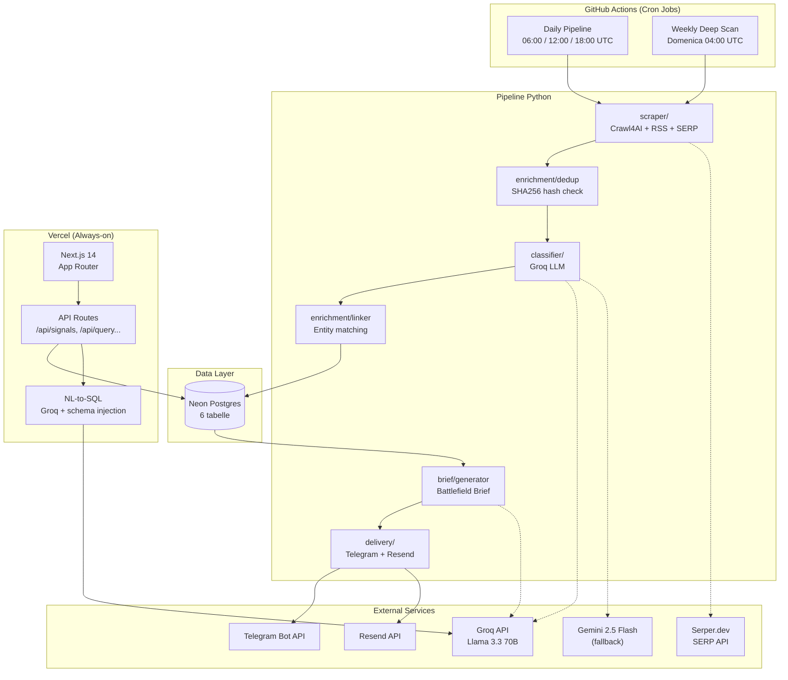

# GreenScan — Architecture Document

## 1. System Overview



---

## 2. Module Breakdown

### 2.1 `pipeline/` — Python Package

```
pipeline/
├── __init__.py
├── main.py                  # Orchestratore: run_daily(), run_weekly(), run_demo()
├── config.py                # Pydantic BaseSettings, carica da env vars
│
├── scraper/
│   ├── __init__.py
│   ├── web.py               # Crawl4AI: async scrape con stealth mode
│   ├── rss.py               # feedparser + newspaper4k: RSS feed parsing
│   ├── serp.py              # Serper.dev: SERP queries per weekly deep scan
│   └── registry.py          # Carica competitors.yaml, gestisce target list
│
├── enrichment/
│   ├── __init__.py
│   ├── dedup.py             # SHA256 content hash, check vs DB
│   ├── extractor.py         # Estrazione entità (aziende, persone, prodotti)
│   └── linker.py            # Match entità → contacts/companies (pg_trgm fuzzy)
│
├── classifier/
│   ├── __init__.py
│   ├── llm.py               # Client Groq + fallback Gemini, retry logic
│   ├── categorizer.py       # Classifica segnale: category enum
│   ├── scorer.py            # Relevance score 1-5
│   └── prompts.py           # Prompt templates (system + few-shot examples)
│
├── storage/
│   ├── __init__.py
│   ├── db.py                # asyncpg connection pool, query helpers
│   ├── models.py            # Dataclass/TypedDict per ogni tabella
│   └── migrations/
│       └── 001_initial.sql  # Schema completo
│
├── brief/
│   ├── __init__.py
│   ├── generator.py         # Query segnali score >= 3, genera brief via Groq
│   ├── templates.py         # Prompt templates per brief (Battlefield Brief format)
│   └── correlator.py        # (Stretch) Cross-signal correlation
│
├── delivery/
│   ├── __init__.py
│   ├── telegram.py          # python-telegram-bot: invio brief + alert
│   └── email.py             # Resend SDK: email HTML brief
│
└── crm/
    ├── __init__.py
    └── nl_query.py           # NL-to-SQL: schema injection + few-shot → SELECT
```

### 2.2 `frontend/` — Next.js 14 App Router

```
frontend/
├── package.json
├── next.config.js
├── tsconfig.json
├── tailwind.config.ts
├── .env.local.example
│
└── src/
    ├── lib/
    │   ├── db.ts              # @neondatabase/serverless client
    │   └── groq.ts            # Groq client per NL-to-SQL
    │
    ├── app/
    │   ├── layout.tsx         # Root layout, nav sidebar
    │   ├── page.tsx           # Dashboard: ultimo brief + stats + segnali recenti
    │   │
    │   ├── competitors/
    │   │   ├── page.tsx       # Lista competitor con tier badges, filtri
    │   │   └── [id]/
    │   │       └── page.tsx   # Profilo competitor: segnali + contatti + timeline
    │   │
    │   ├── contacts/
    │   │   └── page.tsx       # Rubrica contatti, ricerca fuzzy, CRUD inline
    │   │
    │   ├── signals/
    │   │   └── page.tsx       # Feed segnali con filtri (category, score, date)
    │   │
    │   ├── query/
    │   │   └── page.tsx       # Interfaccia NL query (chat-like)
    │   │
    │   └── api/
    │       ├── signals/
    │       │   └── route.ts   # GET: lista segnali con filtri
    │       ├── competitors/
    │       │   ├── route.ts   # GET: lista competitor
    │       │   └── [id]/
    │       │       └── route.ts  # GET: profilo + segnali + contatti
    │       ├── contacts/
    │       │   └── route.ts   # GET/POST/PATCH: CRUD contatti
    │       ├── query/
    │       │   └── route.ts   # POST: NL-to-SQL
    │       ├── briefs/
    │       │   ├── route.ts   # GET: archivio brief
    │       │   └── latest/
    │       │       └── route.ts  # GET: ultimo brief
    │       └── health/
    │           └── route.ts   # GET: stato sistema
    │
    └── components/
        ├── SignalCard.tsx      # Card segnale con score badge, category, summary
        ├── CompetitorRow.tsx   # Riga competitor in tabella
        ├── ContactForm.tsx     # Form CRUD contatto
        ├── QueryChat.tsx      # Interfaccia NL query
        ├── BriefViewer.tsx    # Render markdown brief
        └── Filters.tsx        # Componente filtri riutilizzabile
```

---

## 3. Database Schema (Neon Postgres)

```sql
-- Estensioni richieste
CREATE EXTENSION IF NOT EXISTS pg_trgm;

-- ============================================================
-- TABELLA 1: competitors
-- I 30 competitor tracciati attivamente
-- ============================================================
CREATE TABLE competitors (
    id              SERIAL PRIMARY KEY,
    name            TEXT NOT NULL UNIQUE,
    tier            SMALLINT NOT NULL CHECK (tier IN (1, 2, 3)),
                    -- 1 = direct competitor, 2 = adjacent, 3 = emerging
    sector          TEXT NOT NULL,
                    -- es: "precision_ag", "iot_sensors", "farm_management"
    website         TEXT,
    linkedin_url    TEXT,
    description     TEXT,
    scrape_urls     JSONB DEFAULT '[]'::JSONB,
                    -- Array di URL da scrape-are per questo competitor
    rss_feeds       JSONB DEFAULT '[]'::JSONB,
                    -- Array di RSS feed URLs
    serp_queries    JSONB DEFAULT '[]'::JSONB,
                    -- Array di query SERP per weekly deep scan
    created_at      TIMESTAMPTZ DEFAULT NOW(),
    updated_at      TIMESTAMPTZ DEFAULT NOW()
);

-- ============================================================
-- TABELLA 2: companies
-- Superset: competitor + qualsiasi azienda menzionata nei segnali
-- ============================================================
CREATE TABLE companies (
    id              SERIAL PRIMARY KEY,
    name            TEXT NOT NULL,
    type            TEXT NOT NULL DEFAULT 'other',
                    -- 'competitor', 'partner', 'customer', 'investor', 'other'
    competitor_id   INTEGER REFERENCES competitors(id) ON DELETE SET NULL,
                    -- Se è un competitor tracciato, link alla entry
    website         TEXT,
    sector          TEXT,
    country         TEXT,
    notes           TEXT,
    created_at      TIMESTAMPTZ DEFAULT NOW(),
    updated_at      TIMESTAMPTZ DEFAULT NOW()
);

CREATE INDEX idx_companies_name_trgm ON companies USING gin (name gin_trgm_ops);

-- ============================================================
-- TABELLA 3: contacts
-- Persone associate ad aziende
-- ============================================================
CREATE TABLE contacts (
    id              SERIAL PRIMARY KEY,
    full_name       TEXT NOT NULL,
    role            TEXT,
                    -- es: "CEO", "CTO", "Head of Sales"
    company_id      INTEGER REFERENCES companies(id) ON DELETE SET NULL,
    email           TEXT,
    linkedin_url    TEXT,
    phone           TEXT,
    confidence      REAL NOT NULL DEFAULT 0.5,
                    -- 1.0 = inserito manualmente
                    -- 0.6-0.8 = estratto da LLM
                    -- 0.3-0.5 = match fuzzy
    source          TEXT,
                    -- 'manual', 'llm_extracted', 'serp', 'linkedin'
    notes           TEXT,
    created_at      TIMESTAMPTZ DEFAULT NOW(),
    updated_at      TIMESTAMPTZ DEFAULT NOW()
);

CREATE INDEX idx_contacts_name_trgm ON contacts USING gin (full_name gin_trgm_ops);
CREATE INDEX idx_contacts_company ON contacts (company_id);

-- ============================================================
-- TABELLA 4: signals
-- Core: ogni segnale raccolto e classificato
-- ============================================================
CREATE TABLE signals (
    id              SERIAL PRIMARY KEY,
    competitor_id   INTEGER REFERENCES competitors(id) ON DELETE CASCADE,
    source_url      TEXT NOT NULL,
    source_type     TEXT NOT NULL,
                    -- 'web_scrape', 'rss', 'serp', 'manual'
    title           TEXT,
    content         TEXT,
                    -- Contenuto raw (markdown)
    summary         TEXT,
                    -- Summary generato da LLM (2-3 frasi)
    category        TEXT NOT NULL,
                    -- 'product_launch', 'partnership', 'funding',
                    -- 'hiring', 'expansion', 'regulatory',
                    -- 'technology', 'market_move', 'other'
    relevance_score SMALLINT NOT NULL CHECK (relevance_score BETWEEN 1 AND 5),
                    -- 1 = noise, 5 = critical
    content_hash    TEXT NOT NULL,
                    -- SHA256 del content per dedup
    entities_json   JSONB DEFAULT '{}'::JSONB,
                    -- {"companies": [...], "people": [...], "products": [...]}
    scraped_at      TIMESTAMPTZ DEFAULT NOW(),
    created_at      TIMESTAMPTZ DEFAULT NOW()
);

CREATE UNIQUE INDEX idx_signals_content_hash ON signals (content_hash);
CREATE INDEX idx_signals_competitor_date ON signals (competitor_id, scraped_at DESC);
CREATE INDEX idx_signals_category ON signals (category);
CREATE INDEX idx_signals_score ON signals (relevance_score);
CREATE INDEX idx_signals_entities ON signals USING gin (entities_json jsonb_path_ops);
                    -- jsonb_path_ops: molto più compatto di jsonb_ops default
                    -- (trade-off: supporta solo @> operator, sufficiente per questo use case)

-- ============================================================
-- TABELLA 5: briefs
-- Archivio dei Battlefield Brief giornalieri
-- ============================================================
CREATE TABLE briefs (
    id              SERIAL PRIMARY KEY,
    brief_date      DATE NOT NULL UNIQUE,
    content         TEXT NOT NULL,
                    -- Brief completo in markdown
    signal_count    INTEGER NOT NULL DEFAULT 0,
                    -- Quanti segnali inclusi
    top_signals     JSONB DEFAULT '[]'::JSONB,
                    -- Array di signal IDs inclusi nel brief
    created_at      TIMESTAMPTZ DEFAULT NOW()
);

CREATE INDEX idx_briefs_date ON briefs (brief_date DESC);

-- ============================================================
-- TABELLA 6: scrape_logs
-- Health monitoring per ogni run di scraping
-- ============================================================
CREATE TABLE scrape_logs (
    id              SERIAL PRIMARY KEY,
    run_type        TEXT NOT NULL,
                    -- 'daily', 'weekly', 'manual'
    started_at      TIMESTAMPTZ NOT NULL,
    completed_at    TIMESTAMPTZ,
    status          TEXT NOT NULL DEFAULT 'running',
                    -- 'running', 'success', 'partial_failure', 'failure'
    targets_total   INTEGER NOT NULL DEFAULT 0,
    targets_success INTEGER NOT NULL DEFAULT 0,
    targets_failed  INTEGER NOT NULL DEFAULT 0,
    signals_new     INTEGER NOT NULL DEFAULT 0,
    signals_deduped INTEGER NOT NULL DEFAULT 0,
    errors          JSONB DEFAULT '[]'::JSONB,
                    -- Array di {target, error, timestamp}
    duration_ms     INTEGER,
    created_at      TIMESTAMPTZ DEFAULT NOW()
);

CREATE INDEX idx_scrape_logs_date ON scrape_logs (started_at DESC);
```

### Entity Relationship Diagram

```
┌──────────────┐     ┌──────────────┐     ┌──────────────┐
│ competitors  │────<│   signals    │     │    briefs    │
│              │  1:N│              │     │              │
│ id (PK)      │     │ id (PK)      │     │ id (PK)      │
│ name         │     │ competitor_id │     │ brief_date   │
│ tier (1-3)   │     │ source_url   │     │ content (md) │
│ sector       │     │ category     │     │ signal_count │
│ scrape_urls  │     │ relevance    │     │ top_signals  │
│ rss_feeds    │     │ content_hash │     └──────────────┘
│ serp_queries │     │ entities_json│
└──────┬───────┘     └──────────────┘     ┌──────────────┐
       │                                   │ scrape_logs  │
       │ 0:1                               │              │
       ▼                                   │ id (PK)      │
┌──────────────┐     ┌──────────────┐     │ run_type     │
│  companies   │────<│   contacts   │     │ status       │
│              │  1:N│              │     │ signals_new  │
│ id (PK)      │     │ id (PK)      │     │ errors       │
│ name         │     │ full_name    │     └──────────────┘
│ type         │     │ role         │
│ competitor_id│     │ company_id   │
│ sector       │     │ confidence   │
└──────────────┘     │ source       │
                     └──────────────┘
```

---

## 4. Data Flow — Pipeline Giornaliero

### Step 1: SCRAPE (3-5 min)

```
competitors.yaml → registry.py → lista target
                                      │
                    ┌─────────────────┼─────────────────┐
                    ▼                 ▼                  ▼
               web.py            rss.py             serp.py
            (Crawl4AI)      (feedparser +        (Serper.dev)
            60-90 pagine    newspaper4k)         Solo weekly
            async batch      30 feed, ~30s       30 queries
                    │                 │                  │
                    └─────────────────┼──────────────────┘
                                      ▼
                              List[RawSignal]
                              - url, content, source_type
                              - competitor_id, scraped_at
```

### Step 2: DEDUP (~1 sec)

```
RawSignal[] ──► dedup.py
                  │
                  ├── SHA256(content) per ogni signal
                  ├── Batch check vs signals.content_hash
                  ├── Drop 40-60% unchanged
                  │
                  ▼
            List[NewSignal]  (solo contenuti nuovi)
```

### Step 3: CLASSIFY (30-60 sec)

```
NewSignal[] ──► classifier/
                  │
                  ├── Batch di 3-5 segnali per request (ridotto per TPM limit)
                  ├── Groq Llama 3.3 70B (JSON structured output)
                  │   ├── category: enum
                  │   ├── relevance_score: 1-5
                  │   ├── summary: 2-3 frasi
                  │   └── entities: {companies, people, products}
                  │
                  ├── Pacing: max 30 RPM, 6K TPM (Groq free tier)
                  ├── Fallback attivo: Gemini 2.5 Flash se Groq > 80% quota
                  │
                  ▼
            List[ClassifiedSignal]
```

### Step 4: ENRICH (5-10 sec)

```
ClassifiedSignal[] ──► linker.py
                         │
                         ├── Per ogni entity in entities_json:
                         │   ├── Fuzzy match vs companies.name (pg_trgm, threshold 0.6)
                         │   ├── Fuzzy match vs contacts.full_name
                         │   ├── Se match → link esistente
                         │   └── Se no match → crea nuovo record (confidence 0.5-0.7)
                         │
                         ▼
                   Enriched signals + nuovi companies/contacts
```

### Step 5: STORE (~1 sec)

```
All data ──► db.py
               │
               └── Single transaction:
                   ├── UPSERT companies (ON CONFLICT name)
                   ├── UPSERT contacts (ON CONFLICT full_name + company_id)
                   ├── INSERT signals (content_hash unique)
                   └── UPDATE scrape_logs (targets_success, signals_new)
```

### Step 6: BRIEF (10-20 sec)

```
Neon Postgres ──► generator.py
                    │
                    ├── Query: signals WHERE relevance_score >= 3
                    │         AND scraped_at >= today
                    │         ORDER BY relevance_score DESC
                    │
                    ├── Groq: genera "Battlefield Brief"
                    │   ├── Top signals raggruppati per category
                    │   ├── Key takeaways
                    │   ├── Action items suggeriti
                    │   └── Format: markdown
                    │
                    ▼
                Brief markdown → INSERT briefs
```

### Step 7: DELIVER (~2 sec)

```
Brief markdown ──► delivery/
                     │
                     ├── telegram.py (primario)
                     │   ├── Send brief come messaggio markdown
                     │   ├── Inline buttons per drill-down
                     │   └── Alert separato se score 5 signal
                     │
                     └── email.py (fallback)
                         ├── Resend API
                         └── HTML brief con styling
```

### Step 8: LOG

```
Pipeline metadata ──► scrape_logs
                        ├── duration_ms
                        ├── targets_total / success / failed
                        ├── signals_new / deduped
                        └── errors[] (per troubleshooting)
```

**Tempo totale stimato: 5-8 minuti per run.**

---

## 5. API Design (Next.js API Routes)

### 5.1 `GET /api/signals`

Query segnali con filtri.

**Query Parameters:**
| Param | Tipo | Default | Descrizione |
|-------|------|---------|-------------|
| `competitor_id` | integer | — | Filtra per competitor |
| `category` | string | — | Filtra per categoria |
| `min_score` | integer | 1 | Score minimo (1-5) |
| `from` | ISO date | -7 giorni | Data inizio |
| `to` | ISO date | oggi | Data fine |
| `limit` | integer | 50 | Max risultati (max 100) |
| `offset` | integer | 0 | Paginazione |

**Response:** `{ signals: Signal[], total: number }`

### 5.2 `GET /api/competitors`

Lista competitor con conteggio segnali recenti.

**Query Parameters:**
| Param | Tipo | Default | Descrizione |
|-------|------|---------|-------------|
| `tier` | integer | — | Filtra per tier (1/2/3) |
| `sector` | string | — | Filtra per settore |

**Response:** `{ competitors: Competitor[], total: number }`

### 5.3 `GET /api/competitors/:id`

Profilo competitor completo.

**Response:**
```json
{
  "competitor": { ... },
  "recent_signals": [ ... ],   // ultimi 20 segnali
  "contacts": [ ... ],         // contatti associati
  "signal_trend": {            // segnali per settimana, ultime 4 settimane
    "weeks": [{ "week": "2026-W11", "count": 5, "avg_score": 3.2 }]
  }
}
```

### 5.4 `GET/POST/PATCH /api/contacts`

CRUD contatti.

- **GET**: Lista con ricerca fuzzy (`?q=nome`, usa pg_trgm)
- **POST**: Crea contatto (body: `{ full_name, role, company_id, ... }`)
- **PATCH**: Aggiorna contatto (body: campi da aggiornare)

### 5.5 `POST /api/query`

NL-to-SQL: domanda in linguaggio naturale → risposta.

**Request:**
```json
{
  "question": "Quali competitor hanno lanciato prodotti nell'ultimo mese?"
}
```

**Processing:**
1. Schema injection: inietta DDL delle 6 tabelle nel prompt
2. Few-shot examples (5-10 query comuni)
3. Groq genera SQL (solo SELECT)
4. Validazione: regex allowlist `^SELECT`, no `;` multipli, `LIMIT 100` forzato
5. Esecuzione su connessione read-only con timeout 5s
6. Groq genera risposta naturale dai risultati

**Response:**
```json
{
  "answer": "Negli ultimi 30 giorni, 3 competitor hanno lanciato nuovi prodotti: ...",
  "sql": "SELECT ... (query generata)",
  "rows": [ ... ],
  "confidence": 0.85
}
```

**Sicurezza NL-to-SQL:**
- Regex allowlist: solo `SELECT` statements
- Connessione Neon read-only (connection string separata)
- Timeout query: 5 secondi
- `LIMIT 100` forzato su ogni query
- No subquery con `INSERT/UPDATE/DELETE`
- Log ogni query per audit

### 5.6 `GET /api/briefs` e `GET /api/briefs/latest`

- `/api/briefs`: Lista brief con paginazione (`?limit=10&offset=0`)
- `/api/briefs/latest`: Ultimo brief (usato dalla dashboard)

### 5.7 `GET /api/health`

Stato sistema.

**Response:**
```json
{
  "status": "healthy",
  "last_run": "2026-03-15T06:05:32Z",
  "last_run_status": "success",
  "signals_today": 12,
  "signals_total": 1847,
  "competitors_tracked": 30,
  "db_size_mb": 42.5
}
```

---

## 6. Configurazione GitHub Actions

### `daily_pipeline.yml`

```yaml
name: Daily Pipeline
on:
  schedule:
    - cron: '0 6,12,18 * * *'    # 06:00, 12:00, 18:00 UTC
  workflow_dispatch:               # Trigger manuale

jobs:
  pipeline:
    runs-on: ubuntu-latest
    timeout-minutes: 30
    steps:
      - uses: actions/checkout@v4
      - uses: actions/setup-python@v5
        with:
          python-version: '3.12'
          cache: 'pip'
      - run: pip install -e .

      # Cache Playwright per risparmiare ~1-2 min/run (~90-180 min/mese)
      - name: Cache Playwright browsers
        id: playwright-cache
        uses: actions/cache@v4
        with:
          path: ~/.cache/ms-playwright
          key: playwright-${{ hashFiles('**/pyproject.toml') }}
      - name: Install Playwright (solo se cache miss)
        if: steps.playwright-cache.outputs.cache-hit != 'true'
        run: playwright install chromium --with-deps
      - name: Install Playwright deps (se cache hit)
        if: steps.playwright-cache.outputs.cache-hit == 'true'
        run: playwright install-deps chromium

      - run: python -m pipeline.main daily
        env:
          DATABASE_URL: ${{ secrets.NEON_DATABASE_URL }}
          GROQ_API_KEY: ${{ secrets.GROQ_API_KEY }}
          GEMINI_API_KEY: ${{ secrets.GEMINI_API_KEY }}
          TELEGRAM_BOT_TOKEN: ${{ secrets.TELEGRAM_BOT_TOKEN }}
          TELEGRAM_CHAT_ID: ${{ secrets.TELEGRAM_CHAT_ID }}
          RESEND_API_KEY: ${{ secrets.RESEND_API_KEY }}
```

### `weekly_deep_scan.yml`

```yaml
name: Weekly Deep Scan
on:
  schedule:
    - cron: '0 4 * * 0'           # Domenica 04:00 UTC
  workflow_dispatch:

jobs:
  deep-scan:
    runs-on: ubuntu-latest
    timeout-minutes: 45
    steps:
      - uses: actions/checkout@v4
      - uses: actions/setup-python@v5
        with:
          python-version: '3.12'
          cache: 'pip'
      - run: pip install -e .

      - name: Cache Playwright browsers
        id: playwright-cache
        uses: actions/cache@v4
        with:
          path: ~/.cache/ms-playwright
          key: playwright-${{ hashFiles('**/pyproject.toml') }}
      - name: Install Playwright (solo se cache miss)
        if: steps.playwright-cache.outputs.cache-hit != 'true'
        run: playwright install chromium --with-deps
      - name: Install Playwright deps (se cache hit)
        if: steps.playwright-cache.outputs.cache-hit == 'true'
        run: playwright install-deps chromium

      - run: python -m pipeline.main weekly
        env:
          DATABASE_URL: ${{ secrets.NEON_DATABASE_URL }}
          GROQ_API_KEY: ${{ secrets.GROQ_API_KEY }}
          SERPER_API_KEY: ${{ secrets.SERPER_API_KEY }}
          TELEGRAM_BOT_TOKEN: ${{ secrets.TELEGRAM_BOT_TOKEN }}
          TELEGRAM_CHAT_ID: ${{ secrets.TELEGRAM_CHAT_ID }}
```

---

## 7. Decisioni Architetturali (ADR)

### ADR-001: GitHub Actions come orchestratore (non self-hosted)

**Contesto:** Il pipeline deve girare 3x/giorno senza costi di hosting.

**Decisione:** GitHub Actions cron con runner Ubuntu managed.

**Motivazione:** Zero infra da mantenere. 2,000 min/mese free tier (repo privati; illimitato su pubblici).

**Budget minuti stimato:**
- Daily pipeline: ~7-10 min/run × 3/giorno × 30 giorni = 630-900 min/mese
- Weekly deep scan: ~15-20 min × 4/mese = 60-80 min/mese
- CI (test on push): ~2 min × ~30 push/mese = 60 min/mese
- **Totale stimato: ~750-1,040 min/mese** (37-52% del free tier)
- **Mitigazione critica:** cache Playwright con `actions/cache` risparmia ~1-2 min/run (~90-180 min/mese)
- **Azione richiesta:** monitorare consumo minuti dalla prima settimana via GitHub Settings → Billing

**Trade-off:** Cron GHA non è preciso al minuto (±5-15 min di ritardo). Accettabile per questo use case. Se il repo è pubblico, i minuti sono illimitati — considerare di rendere il repo pubblico se il consumo minuti diventa un problema.

### ADR-002: Neon Postgres come unico data store

**Contesto:** Servono SQL queries, JSONB, full-text search, fuzzy matching, e zero costo.

**Decisione:** Neon Postgres con pg_trgm extension.

**Motivazione:** Scale-to-zero risparmia CU-hours (pipeline attiva solo 15-45 min/giorno). 0.5GB basta per anni di dati. pg_trgm per fuzzy search è built-in, no servizi esterni.

**Trade-off:** Cold start ~1-2s dopo inattività. Mitigato dal fatto che il pipeline pre-scalda la connessione.

### ADR-003: LLM dual-provider con fallback (aggiornato)

**Contesto:** Groq free tier ridotto a inizio 2026: **1,000 RPD** (da 14,400), **30 RPM**, **6,000 TPM**. Con ~200 req/giorno il pipeline ci sta, ma il margine è stretto e il TPM limita il batch size.

**Decisione:** Groq primario, Gemini 2.5 Flash fallback **attivo** (non solo emergenza). Batch ridotti a 3-5 segnali per request (non 10). Retry con exponential backoff, switch provider dopo 3 fallimenti consecutivi. Distribuzione proattiva: se Groq supera 80% quota giornaliera, routing automatico a Gemini per il resto della giornata.

**Motivazione:** Con 1,000 RPD, un singolo retry loop aggressivo può esaurire la quota. Il fallback Gemini (250 RPD) è essenziale, non opzionale. Combinati: 1,250 RPD = margine sufficiente.

**Trade-off:** 6,000 TPM su Groq = max ~12 segnali/minuto (a ~500 token/segnale). La classificazione batch richiede pacing esplicito.

### ADR-004: Content-hash dedup in Postgres (no changedetection.io)

**Contesto:** Serve rilevare contenuti nuovi vs duplicati.

**Decisione:** SHA256 hash del contenuto, stored come colonna `content_hash` con UNIQUE index.

**Motivazione:** changedetection.io richiederebbe Docker hosting (costo). SHA256 in Postgres è zero-cost, l'INSERT fallisce silenziosamente su duplicato (ON CONFLICT DO NOTHING).

### ADR-005: NL-to-SQL via prompt engineering (no LangChain/LlamaIndex)

**Contesto:** Il fondatore vuole query CRM in linguaggio naturale.

**Decisione:** Schema injection + few-shot prompting diretto su Groq, senza framework.

**Motivazione:** Lo schema ha 6 tabelle — abbastanza piccolo da stare in un prompt. LangChain/LlamaIndex aggiungerebbero complessità e dipendenze senza beneficio. 86%+ accuracy raggiungibile con few-shot su schema semplici.

### ADR-006: Pipeline Failure Notification via Telegram

**Contesto:** Se il cron di GH Actions fallisce silenziosamente alle 6 di mattina, nessuno se ne accorge finché il fondatore non chiede "perché non ho ricevuto il brief?".

**Decisione:** Se il pipeline fallisce, invia alert Telegram al team con dettaglio errore. Implementato come try/except nel main orchestrator — se qualsiasi step critico fallisce, il delivery module invia un messaggio di errore prima di propagare l'eccezione.

**Motivazione:** Due righe di codice, zero costi, salva la faccia. Il fondatore sa in tempo reale se qualcosa è rotto.

**Implementazione:**
```python
# In main.py
try:
    await run_daily()
except Exception as e:
    await delivery.send_alert(f"⚠️ Pipeline fallito: {e}")
    raise
```

### ADR-007: Neon Storage Budget — monitorare proattivamente

**Contesto:** Free tier Neon = 0.5 GB. Con content text markdown (~2KB/segnale), entities JSONB, e indici GIN, 10K segnali ≈ 100-150 MB con overhead. Ci si sta dentro il primo anno, ma margine limitato.

**Decisione:** Monitorare `pg_database_size()` nell'endpoint `/api/health`. Se > 400 MB, alert Telegram. Strategia di mitigazione: archiviare segnali con score <= 2 e più vecchi di 90 giorni (drop content, keep metadata).

**Motivazione:** Meglio pianificare la migrazione al piano paid (o l'archiviazione) prima di scoprirlo con un errore in produzione.
